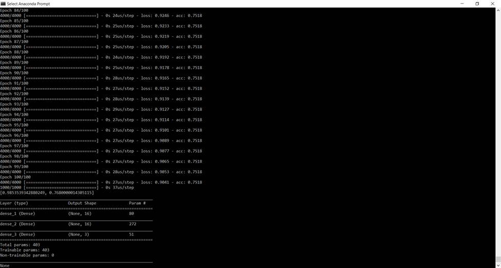
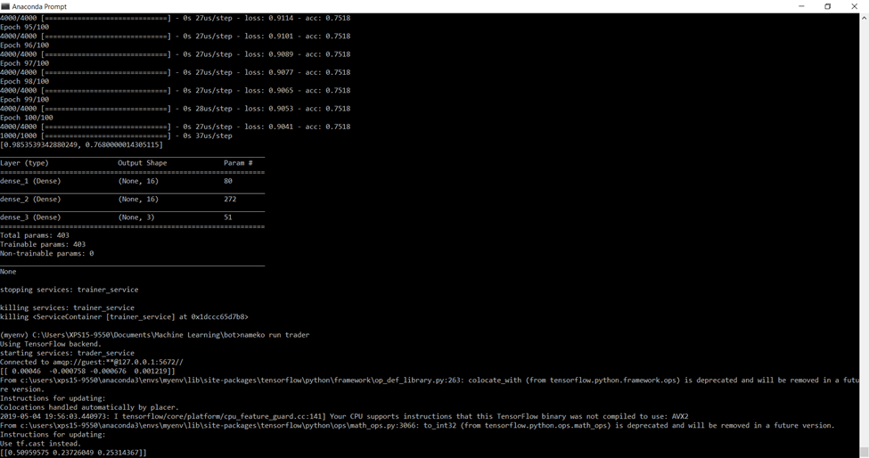

# Neural-Network-Trading-Bot

__Resources used__: Nameko, Numpy, Oanda API, MongoDB, Keras (with Tensorflow backend), Datetime

This is a currency (or other instrument) trading bot using Nameko microservices. It can be used quite easily, with the 
exception of a possible compatability bet
en Python 3.7 and Nameko. 

# DATA.PY # 

The Oanda API is the first step. It provides the connection to get instrument price. It has a 5000 call limit, which can be make training the neural network tedious. An authentification is required to connect, and after that the API quite simple to use. I used MongoDB as a database to store candle information. We begin with the "Data" class. A nameko @timer decorator is used with the first function **get_ohlc**. This function returns the current hour candle. It has to return two candles because the current 1 hour candle will be incomplete, and we want the last completed candle. I also check to see if there any doubles just in case so that it would not train on the same candlestick if the nameko service was running and set to train on new candlesticks. 

The second function, **get_historical_data**, is nearly identical to the get_ohlc function except that it currently is being used as a call to train the neural network in the next file. It also fetches candlesticks, however, it grabs the past 5000 candles. A neural network won't be useful with 5000 data points. 5000 one hour candles is 208.33 days. The to and from parameters in instruments.InsturmentCandles can specify dates to call candles from Oanda. get_historical_data also saves the candles to MongoDB. Although I currently bypass MongoDB (next file), if the bot were to be used for real trades, it would be advisable to save all the candles to MongoDB and then use the database to train the neural network.

# TRAINER.PY # 

class Trainer also has two functions. The first, **get_model**, handles the neural network model. 
There you can add more or less nodes or change the neural network as wanted. The input shape is set to 4. The function returns the model. 

The second function, **trainer** preprocesses and cleans the data from the get_historical_data using a nameko proxy, and will then train 
the model. The data from Oanda is a large JSON, and 'mid' is the key for open, high, low, close price. Afterwards, the data is then 
put into the ratios: High to low, low to open, close to open, high to low. The neural network will train on these ratios, which 
really is used to standardize the prices. As we recently have learned, it is probably better to use an LSTM network rather than a regular 
artificial neural network (check future work). The **retrain** function trains the model and also saves it the model so we can use it in the Trader 
file. The network we use has a ReLu activation layer, and the next two layers are SoftMax activation layers. We were suprised to see that 
the sigmoid function did not work. This was a surprise because the sigmoid function gives binary values which is helpful to determine whether the price will rise or not. 
Instead, we worked with two SoftMax layers instead. We reduced the hidden layer nodes to 16 as the standard 64 is too many considering we only pull
in the limit of 5000 candles. 

The **process** function processes both the candles and sets up for the output. It delivers the prediction based on a list of three numbers. The first number 
The first number tells the percentage of a gain, it's really used to tell the chance that there will be no gain (price will stay the same). 
The second output states the percentage chance the neural network believes the price will increase. The third is the chance it wil decrease.

# TRADER.PY # 

class Trader brings in the data from MongoDB. It processes the data again, the same exact way it was processed earlier. It then loads the model, which is an interesting 
part of the project. The  model, as mentioned earlier, was saved and then called (hardcoded) and used to predict! The  numbers below 
shows the output!

# FUTURE # 

Perform trade or visualize it! We planned to visualize the data. The 
next method of guessing the price would be to see the chance probability of the three outputs. For example, if the output was [.0001,.0001,.80], it would
signal that the price will definitely drop. We planned to visualize the data, however, the neural network took quite a while to get right. 

# OBSTACLES # 

We was unable to find much documentation on the GreenSSL Socket issue we were having when using the nameko service, so we instead created another Anaconda environment with Python 3.6 where I had to redownload all the necessary packages. That seem to be a quick work around.w
